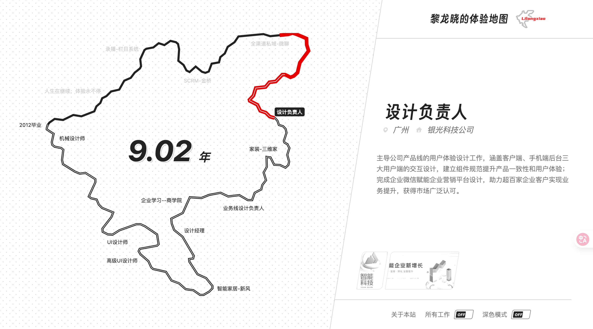

# Experience Map | 体验地图



这是 **LLXiao** 的个人体验地图（中文版），一个基于 Web 的可交互作品集展示项目。它以地图的形式展示了设计师的工作背景、项目经历和生活点滴。

## 核心功能

- **交互式地图导航**：滚轮一次快速滚动到下一个职业节点，赛道进度与右侧内容同步更新
- **地图 3D 倾斜**：鼠标在地图区域移动时，地图产生轻微立体跟手效果
- **动态进度展示**：实时显示当前年份进度和对应的地理位置（广州等）
- **多媒体弹窗预览**：支持项目图片、GIF 动画和视频作品的无缝预览，内置圆点指示器，支持翻页切换
- **深色模式支持**：适配系统主题，支持手动切换深色/浅色模式
- **响应式设计**：适配移动端和桌面端浏览体验
- **备案信息集成**：集成工信部及公安备案信息展示

## 技术栈

- **前端**：Vue.js (2.6.11), Vanilla CSS, SVG 路径动画
- **后端**：PHP（环境配置与页面渲染）
- **字体**：得意黑 (Smiley Sans)
- **构建**：Node.js + terser + clean-css（生产环境资源压缩）

## 本地运行

1. 确保本地安装了 PHP 环境
2. 将项目克隆或解压到服务器根目录
3. 访问 `index.php` 即可启动

```bash
php -S localhost:8000
```

## 部署与生产构建

### 1. 配置 [`env.php`](env.php)

```php
$isProduction = true;              // 正式环境设为 true
$siteUrl = "https://你的正式域名";  // 用于 og:url、canonical
```

- `isProduction = false`：加载 `main.js`、`main.css` 等源文件（开发）
- `isProduction = true`：加载 `main.min.js`、`main.min.css` 等压缩文件（生产）

### 2. 构建压缩资源

部署前在项目根目录执行：

```bash
npm install
npm run build
```

将生成：

- `assets/main.min.js`
- `assets/main.min.css`
- `assets/data.min.js`
- `assets/image-modal.min.js`

### 3. 缓存说明

- HTML 使用 `Cache-Control: no-cache`，便于发版后立即生效
- 静态资源通过 `?v=` 参数（基于文件修改时间的 MD5）做版本戳

## 数据结构（`assets/data.js`）

每个 corner 节点主要字段：

| 字段 | 含义 |
|------|------|
| `ch` | 职位 / 阶段标题 |
| `company` | 公司或学校名称 |
| `de` | 城市 |
| `more` | 详情说明（HTML） |
| `st` / `ed` | 在总进度 0~1 中的区间 |
| `imgs` | 缩略图与弹窗媒体列表 |

## 备案信息

- **粤ICP备**：2025426060号
- **粤公网安备**：44011802001137号

## 致谢

感谢所有为本项目提供灵感和技术支持的朋友们：

- jjying、LXM、一言一语

---
Designed & Developed by [LLXiao](mailto:xiliab@icloud.com)
